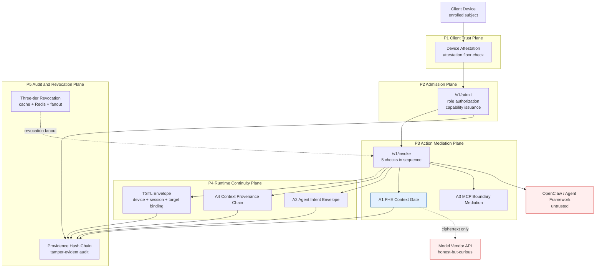
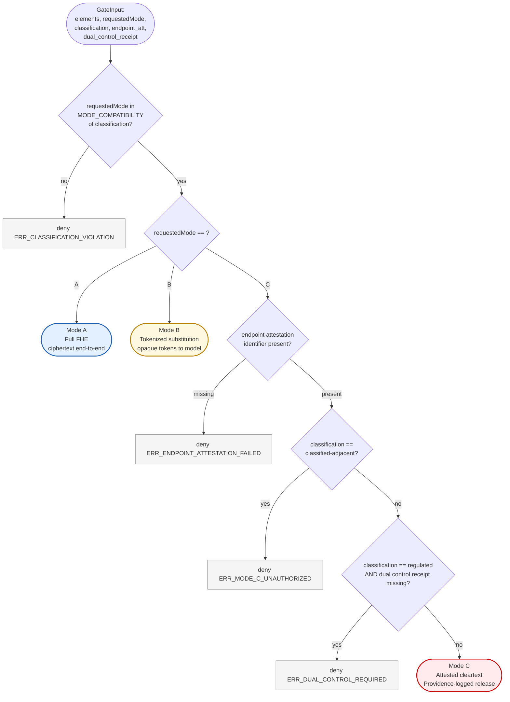
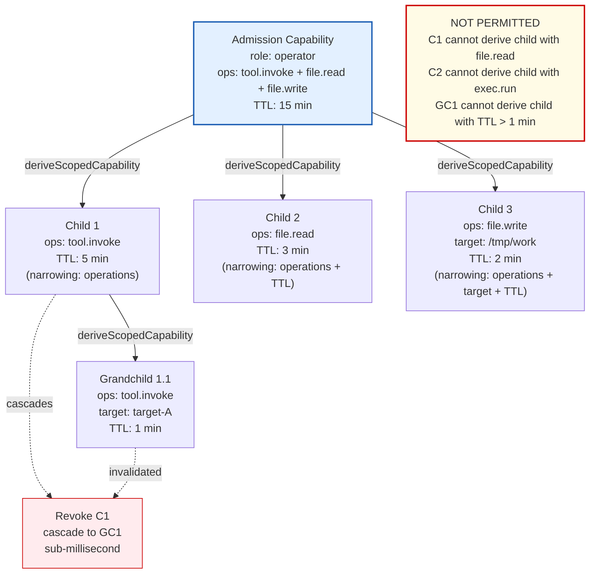
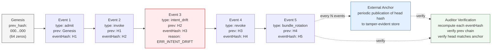

# Architecture Figures

*Referenced in the Zenodo paper v1.0. Mermaid source renders natively on
GitHub and most modern markdown viewers. PNG exports for PDF embedding are
in this directory with the same basename.*

---

## Figure 1. Five-plane architecture of XSOC-NIE-GUARD

Described in Section 3.2. Every operation from the agent framework flows
through the mediation layer via the single front door at /v1/admit and
/v1/invoke. No bypass path reaches OpenClaw directly.



---

## Figure 2. FHE Context Gate three-mode decision flow

Described in Section 6.5. The gate is a deterministic function of operation
inputs and policy state. Every denial returns a structured reason code and
emits a Providence event.



---

## Figure 3. Capability Derivation Tree

Described in Section 4.4. Children are strictly narrower than parents;
widening is not a permitted operation. Revocation cascades from parent to
all descendants in sub-millisecond time.



---

## Figure 4. Providence hash chain structure

Described in Section 10.2. Each event carries a hash of the preceding
event's hash. Truncation is detectable; external anchoring of the head
hash at periodic intervals closes the remaining gap.



---

## Figure source files

All four figures are maintained as Mermaid source in this document. To
regenerate PNG or SVG exports for PDF embedding, use the `mmdc` command
line tool from the mermaid-cli npm package:

```bash
npm install -g @mermaid-js/mermaid-cli
# Then from the repo root:
mmdc -i docs/figures/figures.md -o docs/figures/figure-exports/
```

The rendered PDF of the Zenodo paper includes these figures via
fenced code block rendering in Pandoc with the mermaid filter, or as
pre-rendered PNG imports where the filter is unavailable.
